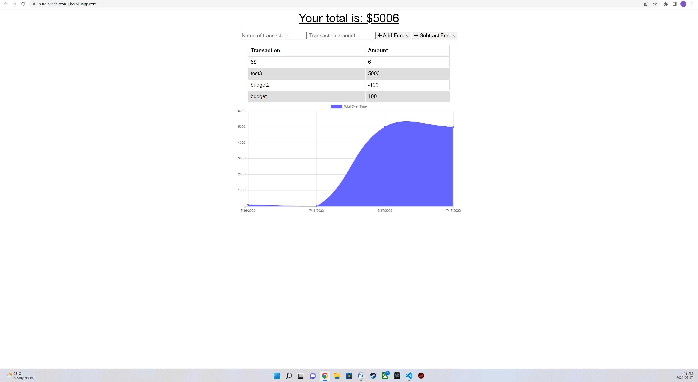

#  Budget Tracker

### 19. Progressive Web Applications (PWA) Challenge: Budget Tracker

## Project Description
A budget tracker application that allows users to add expenses and deposits to their budget either offline on thier local machine or online through the deployed heroku app

## Installation
You can clone the project from GitHub by copying either HTTPS or SSH link or by downloading the project as a zip file. Run npm start 
  
## Deployed Website
https://pure-sands-88403.herokuapp.com/

## Screenshot
![Screenshot]

## Contribution
Made by Joe Chaaya